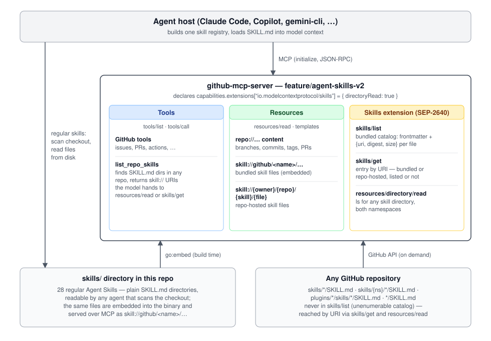

# Experiments

Scenario harnesses for exercising SEP-2640 v1 (`skills/list` + `skills/get` + `resources/directory/read`) against real hosts and servers. This tree was restarted from scratch for the v1 protocol methods; the earlier multi-host harnesses (fast-agent, hermes, HF demos) built against the index.json draft live on the `feature/resource-sep-early-findings` branch for reference.

Current harnesses:

- [`goose/`](goose/) — drives the goose CLI (branch `skills-sep-2640-port` of https://github.com/olaservo/goose) against a running SEP-2640 server.

Reference server for all harnesses: [github/github-mcp-server#3046](https://github.com/github/github-mcp-server/pull/3046), branch `feature/agent-skills-v2` of https://github.com/olaservo/github-mcp-server.

The 28 bundled skills are plain `SKILL.md` directories in the checkout, embedded at build time and served as `skill://github/<name>/…`; `skills/list` enumerates only these. Skills in any GitHub repository are reachable by URI (`skill://{owner}/{repo}/{skill}/{file}`) through `skills/get`, `resources/read`, and `resources/directory/read`, with `list_repo_skills` as the tool that finds them, but they never appear in `skills/list`.

Second server: [skills-over-mcp-demo](https://github.com/olaservo/skills-over-mcp-demo), a small SEP-2640 server on the v2 TypeScript SDK, live and unauthenticated at `https://olaservo-skills-over-mcp-demo.hf.space/mcp`. It adds what the GitHub server lacks: an unlisted skill reachable only through the server's `instructions` pointer and `skills/get`, supporting files (so the digest and size gate is exercised), and a multi-segment skill path. Free Spaces sleep when idle; the harness's wire probe wakes it before goose connects.

Conventions shared by all harnesses: the runner never spawns the MCP server — it connects to an already-running server at the scenario's `mcp_server.endpoint` — and the scenario file is always an explicit `--scenario <path>` argument.
