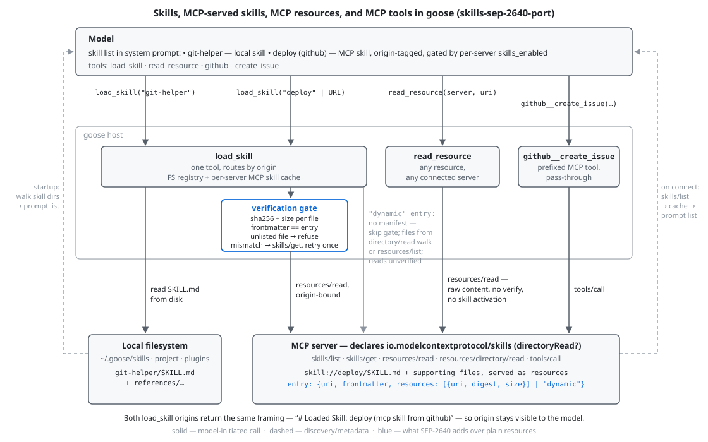

# goose scenario harness

Runs one scenario against the goose CLI and a running SEP-2640 server, and records two things: what was **discoverable** (the server's declared capability and `skills/list` names, probed directly on the wire, plus whether the model could enumerate the skills from its own instructions) and what was **used** (every tool call goose made, which skills were loaded, which resources were read).

## Surfaces under test



How goose (`skills-sep-2640-port`) exposes SEP-2640 to the model: local and MCP-served skills share one prompt list and one `load_skill` tool that routes by origin; MCP loads pass through the verification gate (sha256 + size per file, frontmatter identity, unlisted-file refusal, one `skills/get` retry); `read_resource` reads raw content from any server with no verification or skill activation; prefixed MCP tools pass straight through to `tools/call`. `"dynamic"` entries skip the gate.

## Prerequisites

- A goose build with skills-over-MCP support: branch `skills-sep-2640-port` of https://github.com/olaservo/goose (`cargo build -p goose-cli`). Point the harness at the binary with `--goose` or `GOOSE_BIN`. Use `fdf9ae6c` or later: the 2026-08-21/24 upstream merges left `OAuthStepUpClient` without `skills_list`/`skills_get`/`directory_read` forwarding, so every streamable HTTP server reported `Transport closed`.
- A running SEP-2640 server. Reference: draft PR [github/github-mcp-server#3046](https://github.com/github/github-mcp-server/pull/3046), branch `olaservo:feature/agent-skills-v2` (`09ea2f9f` or later for the b405ba5 `size`/`"dynamic"` contract) — `go build -o github-mcp-server-skills.exe ./cmd/github-mcp-server`, then `./github-mcp-server-skills.exe http --port 8082`. The harness never starts the server; it connects to the scenario's `mcp_server.endpoint`.
- Auth: when the scenario sets `mcp_server.bearer_cmd`, it is run once and its output sent as a `Authorization: Bearer …` header by both the wire probe and goose. Omit it for unauthenticated servers.
- An LLM provider goose can use. The harness writes an isolated goose config (nothing in your real config is touched); provider credentials come from the system keyring or provider env vars as usual. Defaults: `anthropic` / `claude-sonnet-4-6`, overridable per scenario.

Scenarios named `demo-*` run against the public demo Space instead (see [`../README.md`](../README.md)); they need no server or auth setup. Observed 2026-08-25: the live Space negotiates `2025-11-25` and its `skills/list` carries no `ttlMs`/`cacheScope`, unlike the demo repo's README claims for its current commit; the deployment may be older than the repo.

## Run

```
uv run --with pyyaml run_scenario.py --scenario scenarios/discovery-and-load.yaml
```

The result JSON lands in `results/`, the isolated goose config root in a temp dir (path printed; it contains the bearer token when one was used, delete when done). Exit code is 0 only if every check passed.

## Scenario format

```yaml
name: discovery-and-load
mcp_server:
  endpoint: http://localhost:8082/mcp
  bearer_cmd: gh auth token        # optional; omit for unauthenticated servers
provider: anthropic                # optional
model: claude-sonnet-4-6           # optional
prompt: |
  ...single user turn given to goose...
expect:
  extension_declared: true         # server declares io.modelcontextprotocol/skills
  resources_sized: true            # every manifest element in skills/list carries an integer size
  discovered: [create-issue]       # ⊆ wire skills/list names AND each appears in the reply text
  loaded: [create-issue]           # ⊆ load_skill calls whose result was framed content (`# Loaded Skill:` / `# Loaded:`), not an error
  tools: [load_skill]              # optional, ⊆ tool names goose called
  resources_read: [skill://…]      # optional, ⊆ the `uri` args of read_resource calls
```

Every `expect` key is optional; omitted keys are recorded but not asserted. The harness grades nothing else — it logs the full tool-call trace and the reply tail so a human can read what actually happened.
